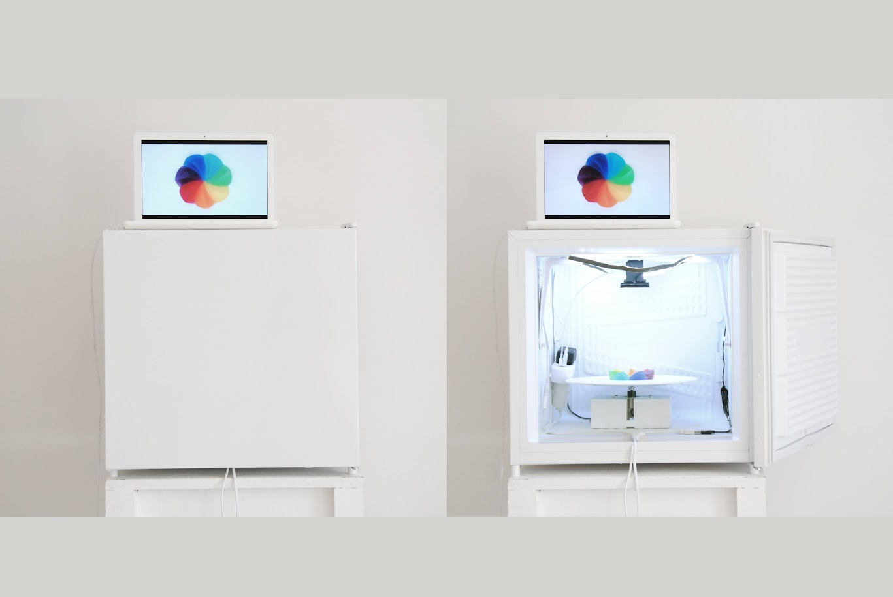

# Smart Rainbow 7.0 (System) 🌈

**Smart Rainbow 7.0** is ainteractive art project combining **environmental awareness**, **digital systems**, and **creative expression**. The Flutter Android App and ESP32 motor control system are integral components that bring the installation to life by connecting **real-time climate data** with **physical and digital experiences**.

---

## Highlights
- **Interactive Installation**: A freezer box houses ice sculptures resembling the “rainbow error cursor,” symbolizing climate change’s frozen and fragile reality.
- **Digital Integration**: Real-time webcam feeds connect the analog sculpture to a digital MacBook display, emphasizing interconnected systems.
- **Sociopolitical Commentary**: The rainbow symbolizes diversity, peace, and environmental awareness, addressing both historical and contemporary issues.

---

## Climate Change Monitoring

### 📱 Flutter Android App

The Flutter Android App acts as the interactive interface for the installation, allowing users to explore climate data and directly influence the physical sculpture’s behavior.

#### Key Features
1. **Real-Time Temperature Data**:
   - Fetches historical and current temperature data from the **GeoSphere Austria weather archive API**.
   - Allows users to select historical dates (from 1855 onward) for comparison with the current daily average temperature.
2. **Interactive Visualizations**:
   - Displays temperature differences through intuitive graphs and animations.
   - Real-time updates show how the ice sculpture responds to climate data.
3. **Bluetooth Connectivity**:
   - Sends calculated rotation speed data to the **ESP32 microcontroller** via **Bluetooth Low Energy (BLE)**.
   - Enables seamless communication with the motor control system.
4. **Aesthetic Design**:
   - A vibrant, rainbow-inspired UI reflects the installation’s theme.
   - Simple navigation ensures accessibility for all users.

---

### 🛠️ ESP32 Motor Control System

The motor control system, powered by an **ESP32 microcontroller**, translates the app’s data into precise physical movements, bringing the installation’s rotating ice sculpture to life.

#### Key Components
1. **ESP32 Microcontroller**:
   - Receives rotation speed data via Bluetooth from the Flutter app.
   - Processes data and controls the motor’s operation.
2. **Stepper Motor**:
   - Drives the rotating platform holding the ice sculpture.
   - Provides precise speed control to reflect temperature differences.
3. **Motor Driver**:
   - Converts ESP32 control signals into motor movement.
   - Ensures smooth and efficient operation.
4. **Freezer Box Integration**:
   - The sculpture rotates inside a transparent freezer box, symbolizing the fragile and frozen state of climate awareness.

---

## 🔥 A Call to Action

**Smart Rainbow 7.0** invites viewers to reflect, interact, and act—transforming the beauty of errors into a catalyst for systemic change.

> “Choose your color mode, touch the error, and change your system.” 🌍✨

___
**More Info**

# [Smart Rainbow 7.0 (System)](https://www.smartrainbow7punkt0.systems)

# [Smart Rainbow 7.0 (System)](https://fabrikraum.org/information_2.html)

**Smart Rainbow 7.0 (System)** is a multimedia and continuously evolving art (research) project by the **Rainbow Team**—artists **Laurus Edelbacher** and **Anna Watzinger**. The project utilizes the macOS "rotating rainbow cursor" as an interface to communicate the pressing issue of climate change through the prism of the rainbow, a phenomenon rich in beauty, scientific intrigue, and sociopolitical symbolism.  
[Learn more on Fabrikraum](https://fabrikraum.org/information_2.html)

The installation features ice sculptures representing the "rotating rainbow error cursor," housed within a white freezer box. A webcam captures the rotating ice sculpture, streaming it to a digital MacBook display, thereby linking the digital error symbol with the tangible effects of climate change.  
[Visit Fabrikraum for details](https://fabrikraum.org/information_2.html)

For more information on the artists and their work, visit their personal websites:
- **Anna Watzinger**: [annawatzinger.com](https://annawatzinger.com/)
- **Laurus Edelbacher**: [laurusedelbacher.com](https://laurusedelbacher.com/)

To experience the project's online extension, explore the interactive website:  
[smartrainbow7punkt0.systems](http://www.smartrainbow7punkt0.systems/)

